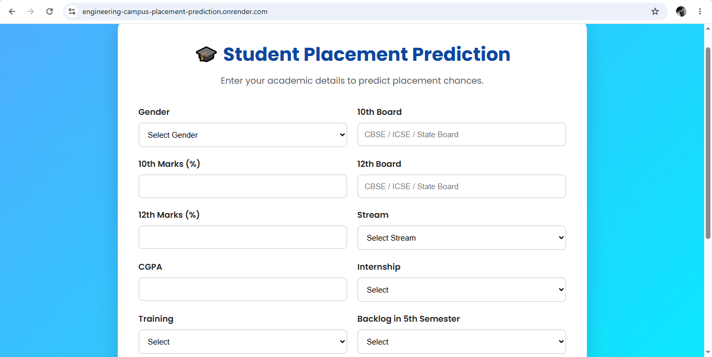
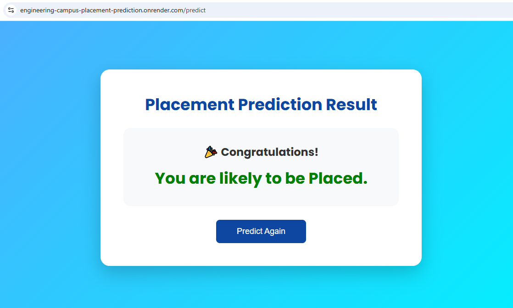

# 🎓 Engineering Campus Placement Prediction

A Machine Learning web application that predicts whether a student is likely to be placed based on their academic performance and skill-related information. The application is built using **Flask** and **Scikit-learn** and is deployed on **Render**.

---

## 🌐 Live Demo

🚀 **Live Website**

(https://engineering-campus-placement-prediction.onrender.com)


## 📌 Features

- 🎯 Predicts student placement using Machine Learning
- 📊 Real-time prediction
- 🎓 Academic details based prediction
- 💻 Responsive user interface
- ⚡ Fast Flask backend
- ☁️ Deployed on Render

---

## 🛠 Tech Stack

### Frontend

- HTML5
- CSS3
- JavaScript

### Backend

- Flask

### Machine Learning

- Scikit-Learn
- Pandas
- NumPy
- Joblib

### Deployment

- Render

---

## 📂 Project Structure

```text
Engineering-Campus-Placement-Prediction/
│
├── app.py
├── requirements.txt
├── Procfile
├── README.md
├── .gitignore
│
├── artifacts/
│   ├── model.pkl
│   └── preprocessor.pkl
│
├── static/
│   ├── css/
│   │   └── style.css
│   └── js/
│       └── script.js
│
├── templates/
│   ├── index.html
│   └── result.html
│
└── screenshots/
    ├── home.png
    └── result.png
```

---

## 🚀 Installation

Clone the repository

```bash
git clone https://github.com/sharmariya11/Engineering-Campus-Placement-Prediction.git
```

Move into the project folder

```bash
cd Engineering-Campus-Placement-Prediction
```

Install dependencies

```bash
pip install -r requirements.txt
```

Run the application

```bash
python app.py
```

Open your browser

```
http://127.0.0.1:5000
```

---

## 📊 Machine Learning Workflow

- Data Collection
- Data Preprocessing
- Feature Engineering
- Column Transformer
- Model Training
- Model Serialization
- Flask Integration
- Prediction

---

## 📷 Screenshots

### 🏠 Home Page



---

### 🎯 Prediction Result



---

## 🔮 Future Improvements

- Prediction Confidence Score
- Student Dashboard
- Better UI/UX
- Dark Mode
- PDF Report Generation
- Placement Analytics Dashboard

---

## 👩‍💻 Author

**Riya Sharma**

B.Tech Student

GitHub:

https://github.com/sharmariya11

---

⭐ If you like this project, don't forget to star this repository.